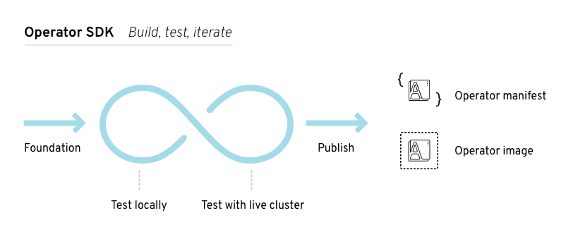
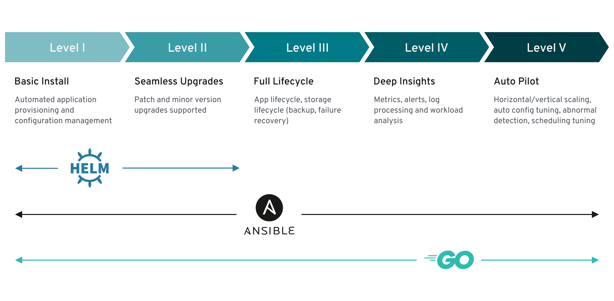

# Vamos falar de Operators?

Os operators são extensões de software para Kubernetes que fazem uso de custom resources para gerenciar aplicações e seus componentes. Os operadores seguem os princípios da Kubernetes,como o control loop. (source: https://kubernetes.io/docs/concepts/extend-kubernetes/operator/)

Ao final dessa talk você vai aprender os conceitos para criar o seu próprio operator e deixar sua aplicação Statefulset no Autopilot.

# Como funciona Stateless Application com o control Loop?

Imagine que você criou um deployment com 5 réplicas, caso você deseje escale essas réplicas para 7, o processo responsável por checar se o estado deseja foi alcançandou não e que medidas devem ser tomas, chama-se control loop.


# Como funciona Stateful Application sem Operators?

Podemos citar como exemplo algum banco de dados, como: MySQL ou Postgres que esteja sendo executado em um cluster Kubernetes. O pessoal de Ops ou DevOps, muito provavelmente irão se preocupar em operações como: Criação de Novos Clusters/DB, Backup, Restore, Escalabilidade, Persistência de Dados. Como são aplicações Stateful você deve persistir dados e atentar-se para que esses dados estejam disponíveis em todos os pods. Todo esse trabalho deveria ser feito manual ou iriam ser criados scripts para automatizar todas essas tasks. É aqui que entra o próximo tópico onde vemos a importância do Operator para aplicações Stateful.

# Como funciona Stateful Application com Operators?

Uma aplicação Statefulset baseada em um operator possui a mesma lógica do control loop customizada, assim como o CRD (Custom Resource Definition), o que vai entregar toda a lógica ao controller de como executar aquela tarefa.
  `````
  Por padrão temos Kind: Deployment, com o operator poderemos criar por exemplo: 
  
  Kind: MyApp.
  `````

# Como posso desenvolver um novo Operator?

Vou deixar aqui dois frameworks que vocês poderão utilizar para começar a dar os primeiros passos: 

- Operator-SDK.
- Kubebuilder.

# Operator SDK. 


Operator SDK é um componente pertencente ao conjunto do [Operator Framework][of-home] que vai nos possibilitar a iniciar a criação dos operators de uma forma fácil. Ela utiliza a biblioteca do container-runtime provendo ferramentas para a abstração da lógica operacional envolvida no Operator.



Uma vez instalado, precisamos definir se vamos criar um Operator com base em Helm, Ansible ou Go:



- Níveis de maturidade de um Operator: 
  - Nível 1 : Instalação Básica.
    - O seu operator é capaz de ser instalado e configurado a partir da sua definifição de CRD.

  - Nível 2 : Atualização contínua.
    - A atualização deve ser o mais fácil possível, identificando o que foi ou não atualizado durante um upgrade.

  - Nível 3 : Full Lifecycle. 
    - Deve ser possível realizar operações de Backup e Restore dos resources a partir do Operator sem intervenção manual.

  - Nível 4 : Métricas Definidas e Expostas.
    - O operator deve expor métricas sobre seu status e performance atuais.
  
  - Nível 5 : Piloto Automático.
    - É o último nível que visa reduzir ao máximo a intervenção manual sobre o operator, entregando automações como: Auto-scaling, Auto-Healing, Auto-tuning, Detecção de anomalias.

# Criação do Scaffold do Operator MyApp.

``````
operator-sdk init --domain example.com --repo github.com/example/memcached-operator

operator-sdk create api --group cache --version v1alpha1 --kind Memcached --resource --controller
``````

[of-home]: https://github.com/operator-framework
